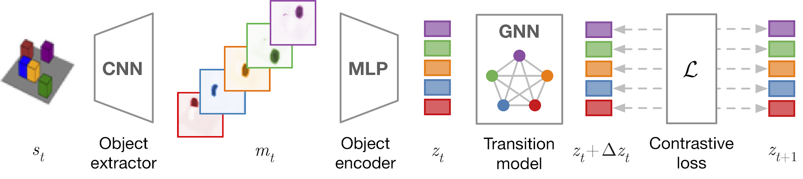

# Contrastive Learning of Structured World Models

This repository contains the official PyTorch implementation of:

**Contrastive Learning of Structured World Models.**  
Thomas Kipf, Elise van der Pol, Max Welling.  
http://arxiv.org/abs/1911.12247



**Abstract:** A structured understanding of our world in terms of objects, relations, and hierarchies is an important component of human cognition. Learning such a structured world model from raw sensory data remains a challenge. As a step towards this goal, we introduce Contrastively-trained Structured World Models (C-SWMs). C-SWMs utilize a contrastive approach for representation learning in environments with compositional structure. We structure each state embedding as a set of object representations and their relations, modeled by a graph neural network. This allows objects to be discovered from raw pixel observations without direct supervision as part of the learning process. We evaluate C-SWMs on compositional environments involving multiple interacting objects that can be manipulated independently by an agent, simple Atari games, and a multi-object physics simulation. Our experiments demonstrate that C-SWMs can overcome limitations of models based on pixel reconstruction and outperform typical representatives of this model class in highly structured environments, while learning interpretable object-based representations.

## Requirements

* Python 3.6 or 3.7
* PyTorch version 1.2
* OpenAI Gym version: 0.12.0 `pip install gym==0.12.0`
* OpenAI Atari_py version: 0.1.4: `pip install atari-py==0.1.4`
* Scikit-image version 0.15.0 `pip install scikit-image==0.15.0`
* Matplotlib version 3.0.2 `pip install matplotlib==3.0.2`

## Generate datasets

**2D Shapes**:
```bash
python data_gen/env.py --env_id ShapesTrain-v0 --fname data/shapes_train.h5 --num_episodes 1000 --seed 1
python data_gen/env.py --env_id ShapesEval-v0 --fname data/shapes_eval.h5 --num_episodes 10000 --seed 2
```
**3D Cubes**:
```bash
python data_gen/env.py --env_id CubesTrain-v0 --fname data/cubes_train.h5 --num_episodes 1000 --seed 3
python data_gen/env.py --env_id CubesEval-v0 --fname data/cubes_eval.h5 --num_episodes 10000 --seed 4
```

**Atari Pong**:
```bash
python data_gen/env.py --env_id PongDeterministic-v4 --fname data/pong_train.h5 --num_episodes 1000 --atari --seed 1
python data_gen/env.py --env_id PongDeterministic-v4 --fname data/pong_eval.h5 --num_episodes 100 --atari --seed 2
```

**Space Invaders**:
```bash
python data_gen/env.py --env_id SpaceInvadersDeterministic-v4 --fname data/spaceinvaders_train.h5 --num_episodes 1000 --atari --seed 1
python data_gen/env.py --env_id SpaceInvadersDeterministic-v4 --fname data/spaceinvaders_eval.h5 --num_episodes 100 --atari --seed 2
```

**3-Body Gravitational Physics**:
```bash
python data_gen/physics.py --num-episodes 5000 --fname data/balls_train.h5 --seed 1
python data_gen/physics.py --num-episodes 1000 --fname data/balls_eval.h5 --eval --seed 2
```

## Run model training and evaluation

**2D Shapes**:
```bash
python train.py --dataset data/shapes_train.h5 --encoder small --name shapes
python eval.py --dataset data/shapes_eval.h5 --save-folder checkpoints/shapes --num-steps 1
```

**3D Cubes**:
```bash
python train.py --dataset data/cubes_train.h5 --encoder large --name cubes
python eval.py --dataset data/cubes_eval.h5 --save-folder checkpoints/cubes --num-steps 1
```

**Atari Pong**:
```bash
python train.py --dataset data/pong_train.h5 --encoder medium --embedding-dim 4 --action-dim 6 --num-objects 3 --copy-action --epochs 200 --name pong
python eval.py --dataset data/pong_eval.h5 --save-folder checkpoints/pong --num-steps 1
```

**Space Invaders**:
```bash
python train.py --dataset data/spaceinvaders_train.h5 --encoder medium --embedding-dim 4 --action-dim 6 --num-objects 3 --copy-action --epochs 200 --name spaceinvaders
python eval.py --dataset data/spaceinvaders_eval.h5 --save-folder checkpoints/spaceinvaders --num-steps 1
```

**3-Body Gravitational Physics**:
```bash
python train.py --dataset data/balls_train.h5 --encoder medium --embedding-dim 4 --num-objects 3 --ignore-action --name balls
python eval.py --dataset data/balls_eval.h5 --save-folder checkpoints/balls --num-steps 1
```

### Cite
If you make use of this code in your own work, please cite our paper:
```
@article{kipf2019contrastive,
  title={Contrastive Learning of Structured World Models}, 
  author={Kipf, Thomas and van der Pol, Elise and Welling, Max}, 
  journal={arXiv preprint arXiv:1911.12247}, 
  year={2019} 
}
```
